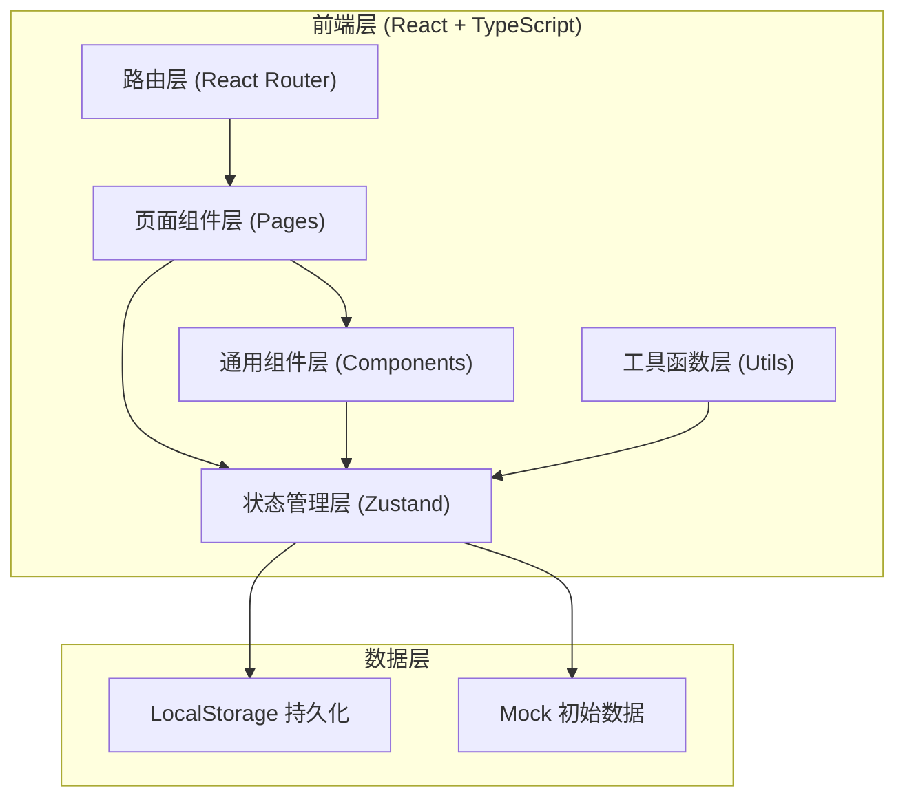
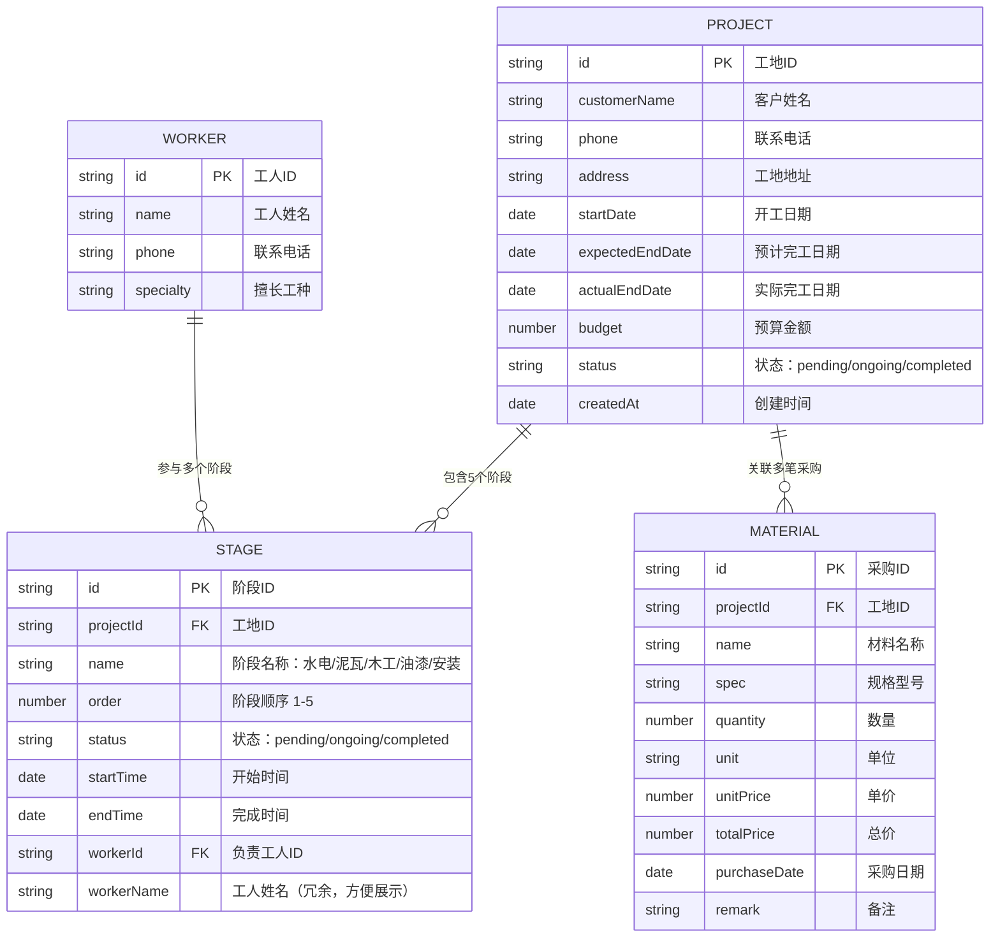

## 1. 架构设计



## 2. 技术描述

- **前端框架**：React 18 + TypeScript
- **构建工具**：Vite 5
- **样式方案**：Tailwind CSS 3
- **路由管理**：React Router DOM 6
- **状态管理**：Zustand 4（轻量级，完美适配小型应用）
- **数据持久化**：LocalStorage + Zustand Persist 中间件
- **图标库**：Lucide React
- **后端**：无后端，纯前端数据驱动（数据存储在浏览器 LocalStorage）

## 3. 路由定义

| 路由路径 | 页面名称 | 用途 |
|-----------|----------|------|
| / | 工地看板（首页） | 展示所有工地列表、数据概览、筛选搜索 |
| /project/:id | 工地详情 | 单个工地的阶段进度、材料采购、工人记录管理 |
| /project/:id/settlement | 结算单 | 生成并展示工地结算单 |
| /workers | 工人统计 | 工人工作量排行榜、参与阶段统计 |

## 4. 数据模型

### 4.1 ER 数据关系图



### 4.2 TypeScript 类型定义

```typescript
// 工地状态
type ProjectStatus = 'pending' | 'ongoing' | 'completed';

// 阶段状态
type StageStatus = 'pending' | 'ongoing' | 'completed';

// 阶段名称
type StageName = '水电' | '泥瓦' | '木工' | '油漆' | '安装';

// 工地
interface Project {
  id: string;
  customerName: string;
  phone: string;
  address: string;
  startDate: string;
  expectedEndDate: string;
  actualEndDate?: string;
  budget: number;
  status: ProjectStatus;
  createdAt: string;
}

// 施工阶段
interface Stage {
  id: string;
  projectId: string;
  name: StageName;
  order: number;
  status: StageStatus;
  startTime?: string;
  endTime?: string;
  workerId?: string;
  workerName?: string;
}

// 材料采购
interface Material {
  id: string;
  projectId: string;
  name: string;
  spec?: string;
  quantity: number;
  unit: string;
  unitPrice: number;
  totalPrice: number;
  purchaseDate: string;
  remark?: string;
}

// 工人
interface Worker {
  id: string;
  name: string;
  phone?: string;
  specialty?: string;
}

// 工人统计
interface WorkerStats {
  workerId: string;
  workerName: string;
  stageCount: number;
  completedCount: number;
  stages: {
    projectId: string;
    projectName: string;
    stageName: StageName;
    status: StageStatus;
  }[];
}
```

### 4.3 Zustand Store 设计

```typescript
interface AppStore {
  // 数据
  projects: Project[];
  stages: Stage[];
  materials: Material[];
  workers: Worker[];

  // 工地操作
  addProject: (data: Omit<Project, 'id' | 'createdAt' | 'status'>) => void;
  updateProject: (id: string, data: Partial<Project>) => void;
  deleteProject: (id: string) => void;
  completeProject: (id: string) => void;

  // 阶段操作
  startStage: (stageId: string, workerId?: string, workerName?: string) => void;
  completeStage: (stageId: string) => void;
  assignWorkerToStage: (stageId: string, workerId: string, workerName: string) => void;

  // 采购操作
  addMaterial: (data: Omit<Material, 'id'>) => void;
  updateMaterial: (id: string, data: Partial<Material>) => void;
  deleteMaterial: (id: string) => void;

  // 工人操作
  addWorker: (data: Omit<Worker, 'id'>) => void;
  updateWorker: (id: string, data: Partial<Worker>) => void;

  // 计算属性
  getProjectTotalCost: (projectId: string) => number;
  getProjectStages: (projectId: string) => Stage[];
  getProjectMaterials: (projectId: string) => Material[];
  getWorkerStats: () => WorkerStats[];
}
```

## 5. 项目目录结构

```
src/
├── components/          # 通用组件
│   ├── Layout/          # 布局组件（侧边栏、头部）
│   ├── ProjectCard.tsx  # 工地卡片
│   ├── StageTimeline.tsx # 阶段时间线
│   ├── MaterialTable.tsx # 材料表格
│   ├── Modal.tsx        # 通用弹窗
│   ├── ProgressBar.tsx  # 进度条组件
│   └── StatCard.tsx     # 数据统计卡片
├── pages/               # 页面组件
│   ├── Dashboard.tsx    # 工地看板
│   ├── ProjectDetail.tsx # 工地详情
│   ├── Settlement.tsx   # 结算单
│   └── WorkerStats.tsx  # 工人统计
├── store/               # 状态管理
│   └── useStore.ts      # Zustand Store
├── types/               # 类型定义
│   └── index.ts         # 全部TS类型
├── utils/               # 工具函数
│   ├── format.ts        # 格式化（日期、金额）
│   └── id.ts            # ID生成器
├── data/                # Mock数据
│   └── mockData.ts      # 初始示例数据
├── App.tsx              # 路由入口
├── main.tsx             # React入口
└── index.css            # 全局样式 + Tailwind
```
